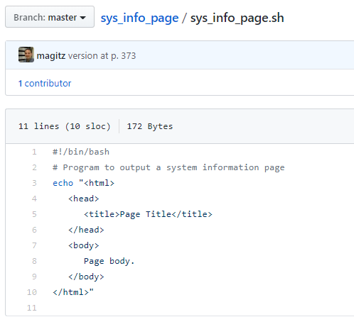

# Notes on TLCL Ch 24 & 25



## Getting setup in github.com

One thing that TLCL doesn't include that I think is critical for good coding is the use of version control, like git. We [already created a github.com account](github_account.md) and created a repository through the github classroom. 

As we embark on writing shell scripts, we will continue to use git and github. To get things setup, let's create your first repository from scratch.

1. Log into your github.com account.
1. There are two ways to create a new repository. Either click the +-icon on the top right and select "New repository", or the green "New" button on the left. 
  
1. For the Repository name, enter "hello_world" (you can use whatever name, but do not use a space!). If you want, you can add a description.
  
1. Leave everything else as it is and click the green "Create repository" button.


1. Log into your account on HiPerGator.
1. In your home directory, create a folder called "hello_world" (or whatever you called your repository in step 3). And change into that directory.
  ```bash
  [magitz@login4 ~]$ mkdir hello_world
  [magitz@login4 ~]$ cd hello_world/
  [magitz@login4 hello_world]$
  ```
1. Return to your browser and the information for setting up your new repository. The easiest way to do this is to click the copy button on the "...or create a new repository on the command line":
  
1. Paste those commands on the command line. Several of the commands will execute on their own, and you will need to hit Enter to make the last one run. Here's the commands, output and my notes as comments (anything after the # is a comment)
```bash
[magitz@login4 hello_world]$ echo "# hello_world" >> README.md # Creates a file called README.md with the text "# hello_world
[magitz@login4 hello_world]$ git init # Tells git that the current directory should be treated as a git repository
                Initialized empty Git repository in /home/magitz/hello_world/.git/
[magitz@login4 hello_world]$ git add README.md # Tells git to track the README.md file
[magitz@login4 hello_world]$ git commit -m "first commit" # Commits the changes to the README.md file, adding a timestamp that can always be recovered
[master (root-commit) 4ea4d62] first commit
 1 file changed, 1 insertion(+)
 create mode 100644 README.md
[magitz@login4 hello_world]$ git remote add origin https://github.com/magitz/hello_world.git # Sets up the repo to have a remote copy called "origin" at github.com
[magitz@login4 hello_world]$ git push -u origin master # Sends the current contents of the repo to the remote, adding it to the "master" branch there.
Username for 'https://github.com': magitz
Password for 'https://                magitz@github.com':
```
1. Return to your repo in github.com and refresh the page. It should look something like:
  
   * What happened here?
   * Your repository is now setup with two copies, one on HiPerGator and one on github.com. One good thing that version control provides is an instant backup copy. Remember, nothing on HiPerGator is backed up. If something terrible happens to the /home server, all user data would be lost. But now we have a backup at github.com!
   * The README.md file is a file that every repository should have. It is a [Markdown file](https://en.wikipedia.org/wiki/Markdown) (.md). Essentially a way to format plain text files. The "# hellow_world" text that we redirected to README.md, is formatted as a top-level header and shows up here in nice big font. This is the starts a markdown file that should be used for documentation of the repository.
   * After creating the markdown file, adding it to the staging area, and committing the change, we linked our repo on HiPerGator to github.com and pushed the contents there.
   * Now we are ready to proceed with the exercise in Ch 24.

## Setup nano to show syntax highlighting

* p. 364: **How to Write a Shell Script**: point one talks about different text editors. There are many options, the easiest for now will be the `nano` text editor. Before we use that, let's turn on syntax highlighting. This makes it easier to read scripts by adding color to different kinds of things. Nano uses a file called .nanorc (a hidden file) stored in your home directory to control this. I have a template you can copy to your home directory:
  ```bash

  cp /ufrc/bsc4452/share/Class_Files/TLCL_files/.nanorc ~/
  ```


## Ch 24: Writing Your First Script

* p. 365: **Script File Format**: As noted, we will use the nano text editor. To create the hello_world script, type: `nano hello_world.sh`. The `.sh` ending is not needed, but again, I think it helps you know that the file is a shell script.



* p. 366: **Executable Permissions**: Before you change the execution permissions, try running your script:
  ```bash
  [magitz@login3 hello_world]$ ./hello_world.sh
  -bash: ./hello_world.sh: Permission denied
  [magitz@login3 hello_world]$
  ```
  The `./` says to look in the current directory. As TLCL mentions in this section, we can't run the script like this because it doesn't have execute permissions set. There are actually a couple of ways around this. One way, as the text does, add execute permission, the other is to call it slightly differently:
  ```bash
  [magitz@login3 hello_world]$ sh hello_world.sh
  Hello World!
  [magitz@login3 hello_world]$
  ```
  Since `sh` is the program that is running, `hello_world.sh` doesn't need execute permissions. I frequently take this route. Seems easier to me than messing with permissions...but moving on...

* p. 366: **Script File Location**: This section gets into the PATH variable, which is really important to understand and PATHs are critical and the source of many problems. The text discusses a couple of options:
  1. You could move your hello_world.sh script to a directory in your PATH. And you will see that `/home/<gatorlink>/bin` is in your PATH by default. But, that would move it out of the git repository and all the goodness that comes with version control.
  1. You could add the current directory to your PATH, but that can lead to a very long list of PATHs and cause other issues.
  1. Personally, I generally suggest that for your own scripts, just use relative or absolute PATHs to call the script. So, either `./hello_world.sh` or `~/hello_world/hello_world.sh`.

### The git workflow

* Before we move on, we have a functional copy of a new script. Now is the time to tell git, we want to track the `hello_world.sh` file, commit the changes we've made and push them to the remote repo.
  ```bash
  [magitz@login3 hello_world]$ git add hello_world.sh
  [magitz@login3 hello_world]$ git commit -m "First version of saying hello"
  [master 8c29b7f] First version of saying hello
  1 file changed, 3 insertions(+)
  create mode 100644 hello_world.sh
  [magitz@login3 hello_world]$ git push
  Counting objects: 6, done.
  Delta compression using up to 32 threads.
  Compressing objects: 100% (5/5), done.
  Writing objects: 100% (5/5), 625 bytes | 0 bytes/s, done.
  Total 5 (delta 1), reused 0 (delta 0)
  remote: Resolving deltas: 100% (1/1), done.
  To git@github.com:magitz/hello_world.git
    cf23ef4..8c29b7f  master -> master
  [magitz@login3 hello_world]$
  ```

## Ch 25: Starting a Project



* p. 371: **First Stage: Minimal Document**: To view this page in a browser, you will need to download the file and open it on your computer.

* p. 372: **First Stage: Minimal Document**: We will make the sys_info_page file in the sys_info_page git repo directory, not ~/bin. Again, I'd suggest calling the file `sys_info_page.sh`.

  Also, once you have the first version of the `sys_info_page.sh` script, `git add`, `git commit` and `git push`.

* p. 373: **Second Stage: Adding a Little Data**: Let's add a little more of the git workflow here. We currently have a functional script that we are happy with. We are about to start making some major changes. Rather than making these changes here, it is easier to make a branch of the repository. This allows us to try new things, test features, etc. without messing up the current functional version. If we don't like what we do, it's easy to trash it and be back where we are. If we do like it, we can merge our changes back into the master branch and have the new version become the main version.

  Let's create a branch called variables (we're going to learn about variables as we do this section)

```bash
  [magitz@login3 sys_info_page]$ git branch variables
  [magitz@login3 sys_info_page]$ git checkout variables
  Switched to branch 'variables'
  [magitz@login3 sys_info_page]$
  ```

  These two commands could have also been simplified to the single `git checkout -b variables`, which creates and checks out the branch.
  
* p. 373: **Second Stage: Adding a Little Data**: make these changes and then run the `git add`, `git commit`, `git push` commands.

  ```bash
  [magitz@login3 sys_info_page]$ git add sys_info_page.sh
  [magitz@login3 sys_info_page]$ git commit -m "Add a little data"
  [variables f512adf] Add a little data
  1 file changed, 2 insertions(+), 2 deletions(-)
  [magitz@login3 sys_info_page]$ git push
  fatal: The current branch variables has no upstream branch.
  To push the current branch and set the remote as upstream, use

      git push --set-upstream origin variables

  [magitz@login3 sys_info_page]$ git push --set-upstream origin variables
  Counting objects: 5, done.
  Delta compression using up to 32 threads.
  Compressing objects: 100% (3/3), done.
  Writing objects: 100% (3/3), 415 bytes | 0 bytes/s, done.
  Total 3 (delta 0), reused 0 (delta 0)
  remote:
  remote: Create a pull request for 'variables' on GitHub by visiting:
  remote:      https://github.com/magitz/sys_info_page/pull/new/variables
  remote:
  To git@github.com:magitz/sys_info_page.git
  * [new branch]      variables -> variables
  Branch variables set up to track remote branch variables from origin.
  [magitz@login3 sys_info_page]$
  ```
  

  Now, lets go look at the repo on github. Click on the sys_info_page.sh file to view it in the repo.
  
  The repo still looks like it did before! That is because, by default, the master branch is always shown. But you can click on the "Branch: master" button and select variables to see that version.

  In fact the original file is still there in our folder too. Checkout the master branch and look at the file:
  ```bash
  [magitz@login3 sys_info_page]$ git checkout master
  Switched to branch 'master'
  [magitz@login3 sys_info_page]$ cat sys_info_page.sh
  #!/bin/bash
  # Program to output a system information page
  echo "<html>
    <head>
        <title>Page Title</title>
    </head>
    <body>
        Page body.
    </body>
  </html>"

  [magitz@login3 sys_info_page]$
  ```
  This is part of the magic of git!

  

  Checkout the variables branch again and keep working through the chapter. Remember to `git add`, `git commit`, `git push` now and then--typically when you think you have point in time you might want to return to, or have done a significant change.
