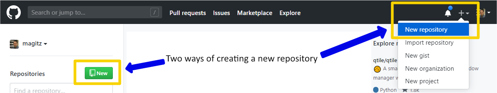
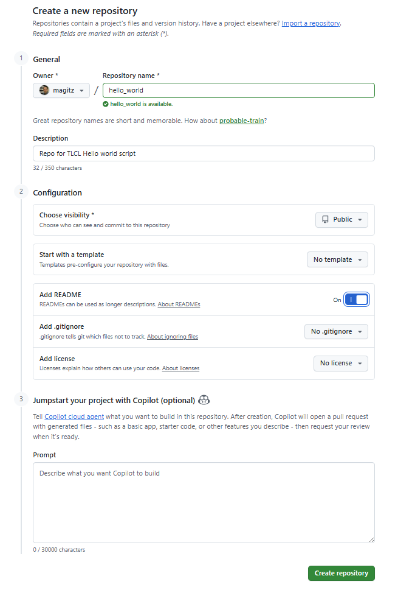
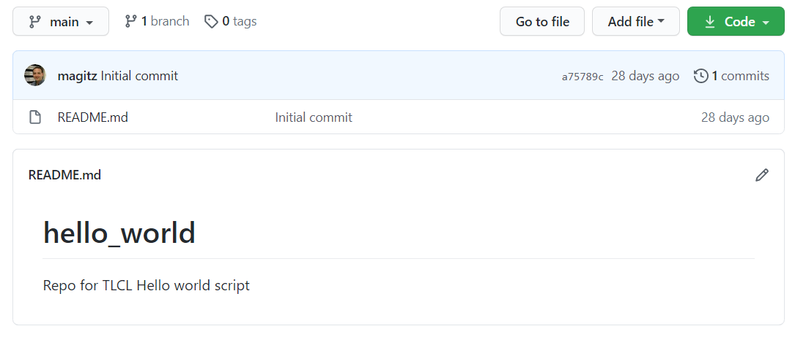
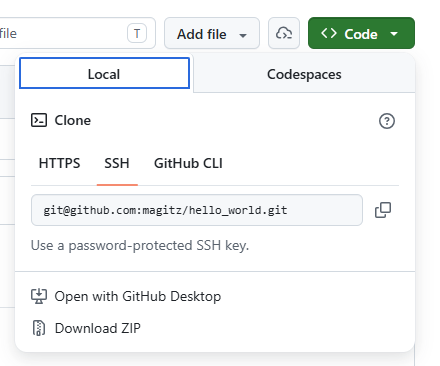
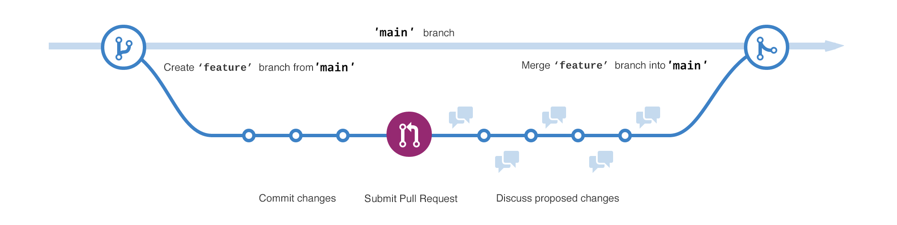
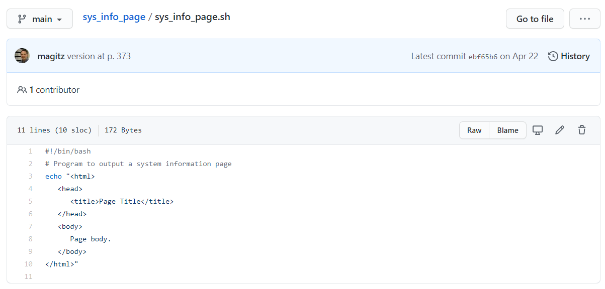



## Using Git and GitHub more

One thing that TLCL doesn't include that I think is critical for good coding is the use of version control, like git. We [already created a github.com account](github_account.md) and created a <a href="#" data-toggle="tooltip" data-original-title="{{site.data.glossary.repository}}">repository</a> through the GiHhub classroom.

As we embark on writing shell scripts, we will continue to use git and GitHub. To get things setup, let's create your first repository from scratch.

### Setup SSH Keys for your account

**As of August 2021, GitHub.com no longer supports using username/password to work with repositories.** You should setup and add a public ssh key to your GitHub.com account. [GitHub has good instructions on doing this](https://docs.github.com/en/authentication/connecting-to-github-with-ssh/about-ssh), but the main steps will be replicated here. If you encounter problems, I suggest checking the detailed instructions from GitHub.

This is done automatically for you with the Codespace, but now, we want to set this up on HiPerGator.

1. Open a Terminal and login to HiPerGator

1. Create an ed25519 ssh key pair to use for GitHub. As outlined [here](https://docs.github.com/en/authentication/connecting-to-github-with-ssh/generating-a-new-ssh-key-and-adding-it-to-the-ssh-agent), type: 

   `ssh-keygen -t ed25519 -C "your_email@example.com"`

   (**Replacing the email address** with the one you used when creating your GitHub account.)

   * If you can't remember which email you used for your GitHub account, you can check at this link: [https://github.com/settings/emails](https://github.com/settings/emails).

1. After typing the above command, you will be asked to enter a file in which to save the key. Hit <kbd>Enter</kbd> to accept the default name.

   > **Note**: The **name** *and* **location** of this file are important! Using a different name or changing the location will cause the key pair to not work.

1. Then you will be asked to enter a passphrase. Leave this empty. This is somewhat less secure, as anyone who has access to your private key would be able to impersonate you. **However, Jupyter Lab and many GUI interfaces do not work with ssh keys with a passphrase.** If you want to use GitHub in Jupyter Lab, do not add a passphrase--just hit <kbd>Enter</kbd> for the passphrase and verification.

1. Now that you have created the ssh key pair, we need to add the public portion to your github account. Type

   `cat ~/.ssh/id_ed25519.pub` **and then copy the output.**

1. Go to your GitHub Settings at: [https://github.com/settings/keys](https://github.com/settings/keys).

1. As outlined [here](https://docs.github.com/en/authentication/connecting-to-github-with-ssh/adding-a-new-ssh-key-to-your-github-account), click the New SSH Key button. [](https://github.com/settings/ssh/new)

1. Give the key a name, "HiPerGator" for example, and paste the public key text you copied above into the Key box.

1. **IMPORTANT: Do not skip this step!!** Test the key and add github.com to your known hosts. Back in the terminal, type: `ssh -T git@github.com` (do **NOT** replace `git` with your username. Type the command exactly as-is).
   * You will likely get a message that the authenticity of the host 'github.com' can't be established. **Type 'yes' to continue**. You will get a Warning that the host has been permanently added to the list of known hosts, and then it should have a line that says:

     > Hi github_username! You've successfully authenticated, but GitHub does not provide shell access.

    That is your indication that everything is setup correctly!

### Configuring git

From: <https://git-scm.com/book/en/v2/Getting-Started-First-Time-Git-Setup>

> The first thing you should do when you install Git is to set your user name and email address. This is important because every Git commit uses this information, and it’s immutably baked into the commits you start creating:

```bash
$ git config --global user.name "John Doe"
$ git config --global user.email johndoe@example.com
```

 > Again, you need to do this only once if you pass the --global option, because then Git will always use that information for anything you do on that system. If you want to override this with a different name or email address for specific projects, you can run the command without the --global option when you’re in that project.
>
> Many of the GUI tools will help you do this when you first run them.

### Create the repository on GitHub

1. Log into your [github.com](https://github.com) account.
1. There are two ways to create a new <a href="#" data-toggle="tooltip" data-original-title="{{site.data.glossary.repository}}">repository</a>. Either click the +-icon on the top right and select "New repository", or click the green "New" button on the left.

  

1. For the Repository name, enter "hello_world" (you can use whatever name, but do not use a space!). If you want, you can add a description.

  

1. **Turn on the "Add README" toggle** and click the green "Create repository" button.
1. That will create your repository and setup a template markdown file for the README.md--every repository should have a README.md file that describes the contents of the repository.
  

### Clone the repository to HiPerGator

Now we want to make a copy of the repository on HiPerGator.

1. Click the green **<>Code** button. Click the **Local** tab. Make sure the **SSH** tab is selected. Click the copy button next to the URL to copy it.

 

1. Log into HiPerGator and `cd` to wherever you want to put this--your home directory is fine, so you can stay there if you want.
1. Type `git clone ` (with a space at the end) and paste the copied URL. Hit enter. The command and output should look like this:

    ```bash
    [magitz@login8 ~]$ git clone https://github.com/magitz/hello_world.git
    Cloning into 'hello_world'...
    remote: Enumerating objects: 3, done.
    remote: Counting objects: 100% (3/3), done.
    remote: Total 3 (delta 0), reused 0 (delta 0), pack-reused 0
    Unpacking objects: 100% (3/3), done.
    [magitz@login8 ~]$
    ````

Now we are ready to write our scripts...so back to the text.

## Ch 24: Writing Your First Script

### Setup nano to show syntax highlighting

* p. 382: **How to Write a Shell Script**: point one talks about different text editors. There are many options, the easiest for now will be the `nano` text editor. Before we use that, let's turn on syntax highlighting. This makes it easier to read scripts by adding color to different kinds of things. Nano uses a file called `.nanorc` (a hidden file) stored in your home directory to control this. I have a template you can copy to your home directory. **Copy and paste the following command on the terminal while logged into HiPerGator:**

    ```bash
    cp /blue/bsc4452/share/Class_Files/TLCL_files/.nanorc ~/
    ```

* Before you start writing the hello_world script, change directories into your repository directory: e.g. `cd hello_world`
* p. 383: **Script File Format**: As noted, we will use the nano text editor. To create the hello_world script, type: `nano hello_world.sh`. The `.sh` ending is not needed, but, I think it helps you know that the file is a shell script and suggest using meaningful file extensions.

  

* p. 384: **Executable Permissions**: Before you change the execution permissions, try running your script:

    ```bash
    [magitz@login8 hello_world]$ ./hello_world.sh
    -bash: ./hello_world.sh: Permission denied
    [magitz@login8 hello_world]$
    ```

  The `./` says to look in the current directory. As TLCL mentions in this section, we can't run the script like this because it doesn't have execute permissions set. There are actually a couple of ways around this. One way, as the text does, add execute permission, the other is to call it slightly differently:

    ```bash
    [magitz@login8 hello_world]$ bash hello_world.sh
    Hello World!
    [magitz@login8 hello_world]$
    ```

  Since `bash` is the program that is running, `hello_world.sh` doesn't need execute permissions. I frequently take this route. Seems easier to me than messing with permissions...do what works best for you...

* p. 384: **Script File Location**: This section gets into the PATH variable, which is really important to understand, and PATHs are critical and the source of *many* problems for users.

  The PATH <a href='#' data-toggle='tooltip' data-original-title='{{site.data.glossary.variable}}'>variable</a> is our first example of an <a href='#' data-toggle='tooltip' data-original-title='{{site.data.glossary.environment_variable}}'>environment_variable</a>. To see the value of the PATH variable, use the `echo` command:

   ```bash
   [magitz@login8 ~]$ echo $PATH
   /apps/ufrc/bin:/opt/slurm/bin:/usr/local/bin:/usr/bin:/usr/local/sbin:/usr/sbin:/opt/puppetlabs/bin:/bin:/home/magitz/bin
   [magitz@login8 ~]$
   ```

   Your PATH is a list of directories, strung together with `:`s where the operating system will look from programs you ask to run. It will start in the first directory in the list and work its way through to the last one. So, **order does matter**--if there are applications with the same name, the first one found will be the one run. We typically speak of <a href='#' data-toggle='tooltip' data-original-title='{{site.data.glossary.prepend}}'>prepending</a> to the PATH vs <a href='#' data-toggle='tooltip' data-original-title='{{site.data.glossary.append}}'>appending</a>.

   By convention, environment variables are written in `ALL_CAPS`.

  The text discusses a couple of options:

    1. You could move your `hello_world.sh` script to a directory in your PATH. And you will see that `/home/<gatorlink>/bin` is in your PATH by default. But, that would move it out of the git repository and all the goodness that comes with version control.
    1. You could add the current directory to your PATH, but that can lead to a very long list of PATHs and cause other issues.
    1. Personally, I generally suggest that for your own scripts, just use relative or absolute PATHs to call the script. So, either `./hello_world.sh` or `~/hello_world/hello_world.sh`.

### `add`, `commit` and `push` your changes

* Before we move on, we have a functional copy of a new script. Now is the time to tell git, we want to track the `hello_world.sh` file (`git add hello_world.sh`), commit the changes we've made (`git commit -m "First version of saying hello"`) and push them to the remote repo (`git push`).

  ```bash
  [magitz@login7 hello_world]$ git add hello_world.sh
  [magitz@login7 hello_world]$ git commit -m "First version of saying hello"
  [main 8c29b7f] First version of saying hello
  1 file changed, 3 insertions(+)
  create mode 100644 hello_world.sh
  [magitz@login7 hello_world]$ git push
  Counting objects: 6, done.
  Delta compression using up to 32 threads.
  Compressing objects: 100% (5/5), done.
  Writing objects: 100% (5/5), 625 bytes | 0 bytes/s, done.
  Total 5 (delta 1), reused 0 (delta 0)
  remote: Resolving deltas: 100% (1/1), done.
  To git@github.com:magitz/hello_world.git
    cf23ef4..8c29b7f  main -> main
  [magitz@login7 hello_world]$
  ```

  That is it for this repository.

## Ch 25: Starting a Project



* p. 389: **First Stage: Minimal Document**: To view this page in a browser, you will need to download the file and open it on your computer.

* p. 389: **First Stage: Minimal Document**: We will make the sys_info_page file in the sys_info_page git repo directory, not ~/bin. Again, I'd suggest calling the file `sys_info_page.sh`.

  Also, once you have the first version of the `sys_info_page.sh` script, `git add`, `git commit` and `git push`.

* p. 391: **Second Stage: Adding a Little Data**: Let's add a little more of the git workflow here. We'll come back to this, but let's take a look at branches in git first.

## More on git branches

Every repo has one branch, hopefully called `main`. But you can create <a href="#" data-toggle="tooltip" data-original-title="{{site.data.glossary.branch}}">branches</a> that essentially give you another copy to work on without messing up that main copy. When you are satisfied with the changes you have made, they can be merged back into the `main` branch. Or, if you mess things up or realize your idea was not well thought out, you can just delete it and not worry that you could have messed up your `main` branch.

Here is an image to illustrate the idea:



We currently have a functional script that we are happy with. We are about to start making some major changes. Rather than making these changes here, it is better to make a branch of the repository. This allows us to try new things, test features, etc. without messing up the current functional version. If we don't like what we do, it is easy to trash it and be back where we are. If we do like it, we can <a href='#' data-toggle='tooltip' data-original-title='{{site.data.glossary.merge}}'>merge</a> our changes back into the main branch and have the new version become the main version.

Let's create a branch called `variables` (we are going to learn about variables as we do this section).

```bash
  [magitz@login9 sys_info_page]$ git branch variables
  [magitz@login9 sys_info_page]$ git checkout variables
  Switched to branch 'variables'
  [magitz@login9 sys_info_page]$
  ```

These two commands could have also been simplified to the single `git checkout -b variables`, which creates and checks out the branch in one step.

* p. 391: **Second Stage: Adding a Little Data**: make the changes for this section, and then run the `git add`, `git commit`, `git push` commands.

  ```bash
  [magitz@login9 sys_info_page]$ git add sys_info_page.sh
  [magitz@login9 sys_info_page]$ git commit -m "Add a little data"
  [variables f512adf] Add a little data
  1 file changed, 2 insertions(+), 2 deletions(-)
  [magitz@login9 sys_info_page]$ git push
  fatal: The current branch variables has no upstream branch.
  To push the current branch and set the remote as upstream, use

      git push --set-upstream origin variables

  [magitz@login9 sys_info_page]$ 
  ```

  

  ```bash
  [magitz@login9 sys_info_page]$ git push --set-upstream origin variables
  Counting objects: 5, done.
  Delta compression using up to 32 threads.
  Compressing objects: 100% (3/3), done.
  Writing objects: 100% (3/3), 415 bytes | 0 bytes/s, done.
  Total 3 (delta 0), reused 0 (delta 0)
  remote:
  remote: Create a pull request for 'variables' on GitHub by visiting:
  remote:      https://github.com/magitz/sys_info_page/pull/new/variables
  remote:
  To git@github.com:magitz/sys_info_page.git
  * [new branch]      variables -> variables
  Branch variables set up to track remote branch variables from origin.
  [magitz@login9 sys_info_page]$
  ```

  Now, let's go look at the repo on github. Click on the `sys_info_page.sh` file to view it in the repo.

  

  The repo still looks like it did before!
  
  That is because the `main` branch is set to be default. But you can click on the "Branch: main" dropdown button and select "`variables`" to see that version.

  In fact the original file is still there in our folder too. Checkout the `main` branch and look at the file:

  ```bash
  [magitz@login9 sys_info_page]$ git checkout main
  Switched to branch 'main'
  [magitz@login9 sys_info_page]$ cat sys_info_page.sh
  #!/bin/bash
  # Program to output a system information page
  echo "<html>
    <head>
        <title>Page Title</title>
    </head>
    <body>
        Page body.
    </body>
  </html>"

  [magitz@login9 sys_info_page]$
  ```

  This is part of the magic of `git`!

  

  Checkout the `variables` branch again and keep working through the chapter. Remember to `git add`, `git commit`, `git push` now and then--typically when you think you have point in time you might want to return to, or have done a significant change.

### Merging git branches

At some point we decide we are ready to <a href='#' data-toggle='tooltip' data-original-title='{{site.data.glossary.merge}}'>merge</a> the branch back into the `main` branch. This updates the `main` branch with the changes you have made in the development branch.

If you are the only one working and you are only working on one thing, this may be simple. If other developers have made changes to the `main` branch, there may be conflicts that your changes create--if you both change the same lines of a file, `git` can't merge on its own and needs your help to resolve the conflicts. We will come back to this later, but since you shouldn't have any conflicts, you are set to merge...

Checkout the `main` branch and then merge:

  ```bash
  [magitz@login9 sys_info_page]$ git checkout main
    Switched to branch 'main'
  [magitz@login9 sys_info_page]$ git status
  # On branch main
  nothing to commit, working directory clean
  [magitz@login9 sys_info_page]$ git merge variables
  Updating 8ad541d..2627d71
  Fast-forward
  sys_info_page.sh | 41 ++++++++++++++++++++++++++++++++---------
  1 file changed, 32 insertions(+), 9 deletions(-)
  [magitz@login9 sys_info_page]$ git push
  Total 0 (delta 0), reused 0 (delta 0)
  To https://github.com/magitz/sys_info_page.git
    8ad541d..2627d71  main -> main
  ```

Since we are done with the `variables` branch we can delete it:

  ```bash
  [magitz@login9 sys_info_page]$ git branch -d variables
  Deleted branch variables on (was 2627d71).
  ```

Don't forget to push the new `main` branch to GitHub!

## Ch 26: Top-Down Design

 {% include callout.html content="This chapter is really important in starting to help you think about how to break down a task into small steps. Taking a complex task and breaking it down into pieces is a lot of what programmers do. Often the stumbling block isn't necessarily the coding, but figuring out how to break the task down into pieces to start the coding. <BR>
 <BR>
 When you are working through this process, you may get stuck. Take a break. Work on something else. Maybe make a sketch of what you want to do. Ask for help!" type="primary" %}

 

There is a ton of great stuff in this chapter and you can work through most of it. Sometimes we talk about writing <a href="#" data-toggle="tooltip" data-original-title="{{site.data.glossary.pseudocode}}">pseudocode</a>. Writing down the steps, as the text does for going to the market on p. 383 is a good way to start breaking down what you need your code to do. Lay out, what do I have, where to I need to get? Fill in the steps you would take to get there. Add more details iteratively. As you go, your notes will progressively look more and more like code. You can start translating steps into real code. Again, breaking down the task into pieces is the main challenge in writing a program. People often get scared by focussing on the goal and not being able to see how to get there, but when you break it down into pieces, each step becomes more tractable and the whole program emerges.

Some notes...

* p. 402: **Shell Functions**: <a href="#" data-toggle="tooltip" data-original-title="{{site.data.glossary.function}}">Functions</a> facilitate breaking down code into manageable chunks. Using the text's analogy, we can write a function to park the car. Once we have the `park_car` function, that part of the go to the market problem is solved. In fact, that part is solved both when we park the car at the market and when we park the car at home when we return! Write once, use many times--this greatly facilitates our coding experience. Additionally, if we realize that we forgot to, for example, add the step to set the parking break, we only need to update the code one place, rather than find everywhere we used the parking code. And lastly, if we move on to writing a program for going to the work, we can re-use the `park_car` function from this program in the new program!

### Passing arguments into functions

I did not realize until someone asked, that this was not covered in the text. It seems so fundamental to how functions work that it didn't even occur to me that it wouldn't be covered...Adding this information now.

We've seen how functions can be used to organize code, promote reusability, and help us think about the steps that are needed to accomplish a task. It may not be clear from the text that functions, similar to scripts and programs, can take input arguments and return information. In keeping with the driving to the market analogy, the park_car function might take a parking lot isle number as an argument and return the parking spot number so you know where your car is parked.

Here is an example of a function that takes two numbers, adds them and returns the sum, this script is also located at `/blue/bsc4452/share/Class_Files/Examples/add_two.sh`:

  ```bash
  #!/usr/bin/bash

  # This script shows how parameters can be passed into a function

  add_two () {
    # Take 2 numbers and add them, returning the sum

    num1=$1 # The first argument is $1, assign to num1 variable
    num2=$2 # The second argument is $2, assign to num2 variable

    sum=$((num1 + num2))  # Add the two numbers
    return $sum  # Return the sum
  }

  value1=5
  value2=10

  add_two $value1 $value2  # Call the add_two function with 2 arguments

  echo "$value1 plus $value2 is $?"  # Print the result
  ```

When we call the function `add_two` we can pass in our two numbers. Those are assigned to the variables $1 and $2. There is also a special variable created that lists all of the arguments passed in, its name is `$@`. **Try modifying the code of the add_two function to print the value of `$@` when it is called.**

We can use those variables in the function to do our stuff. Then we can return information from the function. The main script can use the returned value with the `$?` variable.

Note that Bash does not include the argument names in the function definition line...most languages, including Python, would have something like `add_two (arg1, arg2)` indicating that the function takes two arguments. That's just not how Bash works...

For additional information, I found this page to be helpful: [https://bash.cyberciti.biz/guide/Pass_arguments_into_a_function](https://bash.cyberciti.biz/guide/Pass_arguments_into_a_function).

### Back to the text...

* p. 405: **Local Variables**: It is good to think about <a href="#" data-toggle="tooltip" data-original-title="{{site.data.glossary.local_variable}}">local</a> vs <a href="#" data-toggle="tooltip" data-original-title="{{site.data.glossary.gloabal_variable}}">global variables</a> and the concept of <a href="#" data-toggle="tooltip" data-original-title="{{site.data.glossary.scope}}">scope</a>. We will encounter this throughout the semester as local and global variables are common to most programming languages. The idea is that most variables defined within a function are local to that function, are only available within the function, and are lost when the function ends.

* p. 408: **Keep Scripts Running**: The idea of using <a href="#" data-toggle="tooltip" data-original-title="{{site.data.glossary.stub}}">stubs</a> is very useful. This is also a good method to share code development. One developer can work on implementing one function, while another developer implements a different function.

  

* p. 391: Modification to **`report_home_space()`**: I suggest using the following in place of what is in TLCL (use your GatorLink, not mine...). This will check *your* home directory space usage...

  ```bash
  report_home_space(){
    cat <<- _EOF_
        <h2>Home Space Utilization</h2>
        <pre>$(du -sh /home/magitz/*)</pre>
  _EOF_
    return
  ```
